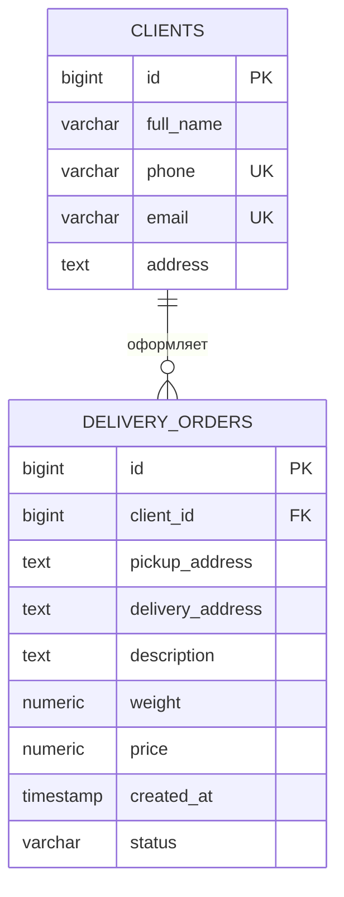

# ER-диаграмма службы доставки

```mermaid
erDiagram
    CLIENTS ||--o{ DELIVERY_ORDERS : "оформляет"

    CLIENTS {
        bigint id PK
        varchar full_name
        varchar phone UK
        varchar email UK
        text address
    }

    DELIVERY_ORDERS {
        bigint id PK
        bigint client_id FK
        text pickup_address
        text delivery_address
        text description
        numeric weight
        numeric price
        timestamp created_at
        varchar status
    }
```

Один клиент может оформить много заказов. Каждый заказ принадлежит ровно одному клиенту через внешний ключ `delivery_orders.client_id`.
